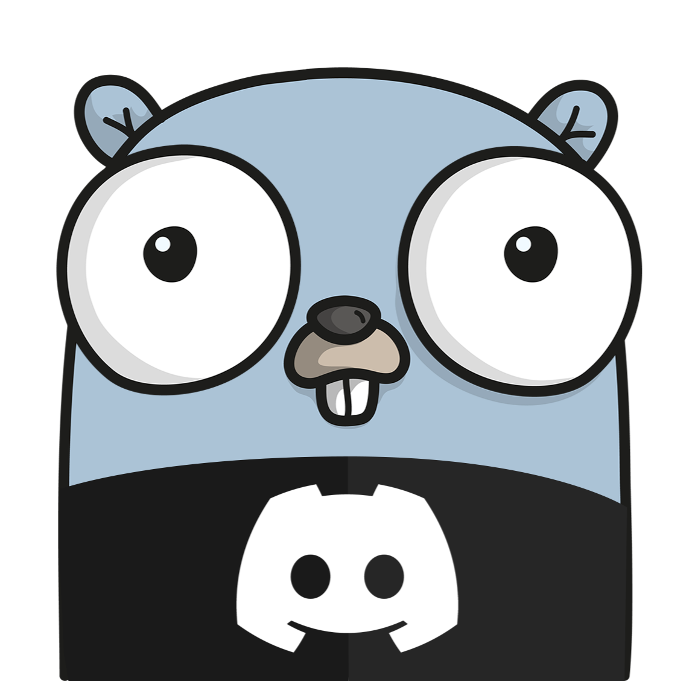

# wumpgo

<p align="center">

</p>

A work in progress Golang Discord library.

[](https://discord.gg/WEsjKwHqSP)

## Installation

```
go get -u wumpgo.dev/wumpgo@v0.0.2
```

## Usage

Checkout the [examples](examples/) for simple usage examples.  If you're looking to get started quickly, check out [wumpgoctl](#wumpgoctl).

## Components

Below is a brief overview of each component of the library.  Most components are designed to work as independently of other components as possible.  For example: if you simply need a REST library to use in an API you're writing, you can use the rest component by itself.

### Objects

The [objects](objects/) package is the base of the library.  Pretty much all other components depend on it.  It contains the Discord API model definitions.

### Rest

The [rest](rest/) package contains a simple Discord REST API client library.  It is designed to be very tunable so it will fit many different usecases.  We provide defaults for the ratelimiter, cache, and proxy, all of which are omitted by default.  The default implementations follow an interface contract, so feel free to bring you own as well.

### Gateway

In the [Gateway](gateway/) package you will find a simple and pluggable gateway implementation.  It uses a dispatcher and receiver model to control how events are delivered in your application.  Dispatchers cause the gateway to dispatch the events to your chosen delivery system for delivery to a receiver.  At the simplest you can use a local dispatcher and receiver for behavior similar to every other library you've used.  On the complex side you can use a message queue or pubsub system for a large, scalable implementation.  We provide a few implementations for common use-cases, but feel free to bring your own. 

### Interactions

[Interactions](interactions/) is a package providing a net/http compatible handler for authenticating and providing very rudamentary routing for Discord webhook interactions.

### Router

The [router](router/) package is a very opinionated Discord Interactions ([application commands](https://discord.com/developers/docs/interactions/application-commands) and [components](https://discord.com/developers/docs/interactions/message-components)) framework built on the rest of the library.  This package runs contrary to the open-endedness of the rest of the library, but is completely optional.  It is designed to get you up and running quickly, at the sacrifice of developer freedom.

Slash commands are defined using Go structs that conform to specific interfaces to set different options on your command.  [cmdgen](cmdgen/) is a go:generate tool provided to allow you to define your slash command options as formatted comments, and automatically generate the interface implemntations from those comments, reducing the amount of boilerplate required to define commands.

### Wumpgoctl

[wumpgoctl](wumpgoctl/) is an optional commandline tool for scaffolding and managing projects using wumpgo.  It is designed to further reduce the time from zero to bot.  Along with the router, it is also very opinionated, and is completely optional.

#### Installation

```sh
go install wumpgo.dev/wumpgo/wumpgoctl@latest
```